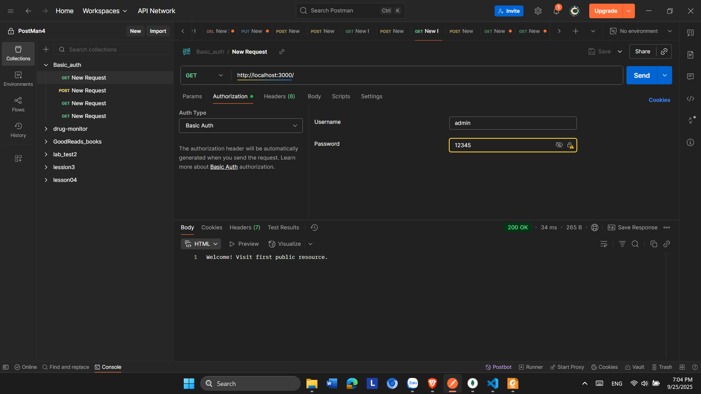
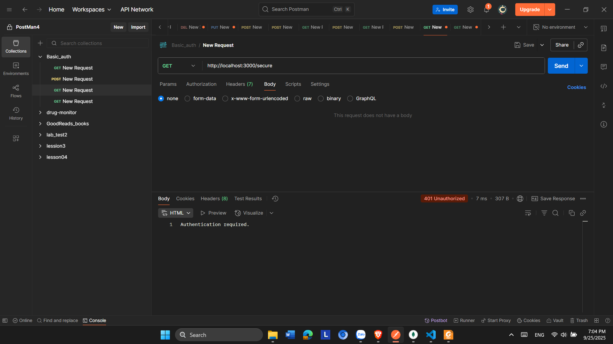

do tui để ở trong public rồi bạn dựa vào cái README.md của tôi để sửa lại đường dẫn và cho tôi # Simple Auth Cách chạy project ### 1. Cài đặt
bash
npm install
2. **Chạy Basic Auth** node basic_auth.js  **Test postman** GET [http://localhost:3000/](http://localhost:3000/) * Username: admin * Password: 123456  GET: http://localhost:3000/secure  GET http://localhost:3000/public  3. Cookie_Session_Auth POST: http://localhost:3001/login  GET: http://localhost:3001/profile  POST: http://localhost:3001/logout 
